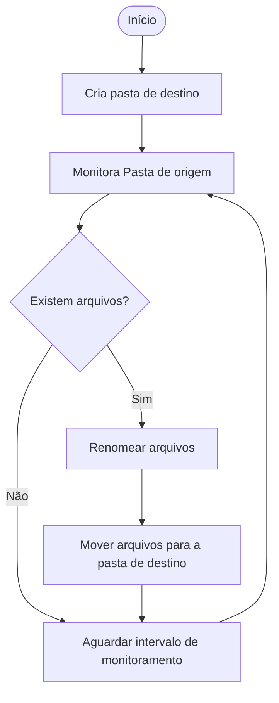
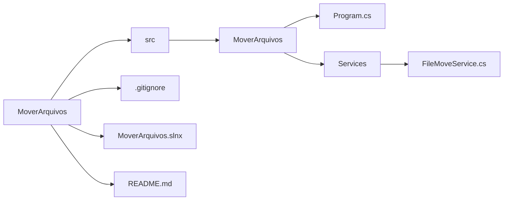

# Automação que Move Arquivos

Esse é um pequeno robô feito para automatizar a tarefa de mover arquivos de uma pasta para outra.

## Objetivos da Automação

1. **Monitorar** uma pasta local onde arquivos são salvos com regularidade;
2. **Buscar** por arquivos;
3. **Renomear** os arquivos **mantendo** o nome original e **acrescentar** a data e hora atuais;
4. **Criar** uma pasta no diretório de destino nomeada com a data atual;
5. **Mover** os arquivos para essa pasta;
6. **Continuar** a monitorar a pasta de entrada de arquivos.

## Benefícios da Automação

- **Evitar** trabalho repetitivo de monitorar e mover arquivos;
- **Reduzir** erros humanos no manejo de arquivos;
- **Melhorar** o tempo e a qualidade do processamento de arquivos;
- **Padronizar** o fluxo de processamento de arquivos;
- **Possibilitar** a auditoria do processo. 

## Tecnologias Utilizadas
- **C#;**
- **.NET;**
- **Biblioteca Padrão;**
- **Automação RPA.**

## Como executar a Automação

- **Configurar** o endereço para as pastas de origem e de destino.
**OU**
- **Manter** a configuração como está no código.

```csharp
string sourceDir = @"C:\Input";
string destDir = @"C:\Output";
```


## Diagrama de funcionamento



## Estrutura do projeto
