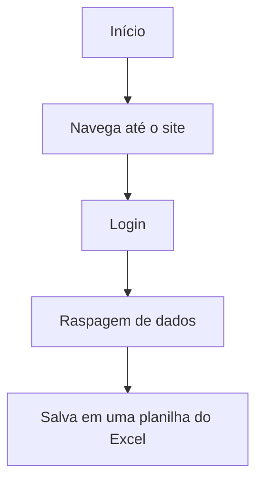

# Extrair tabela da web

A seguinte automação tem por objetivo navegar para o site [ACME](https://demo.applitools.com/) na web, fazer login e extrair os dados de uma tabela.


## Objetivos

1. **Navegar** para um site;
2. **Fazer** login;
3. **Extrair** uma tabela;
4.  **Armazenar** em uma tabela do Excel o resultado.


## Benefícios da Automação

- **Evitar** trabalho repetitivo de realizar logins;
- **Reduzir** erros humanos na raspagem de dados;
- **Melhorar** o tempo e a qualidade do processo de raspagem de dados;
- **Padronizar** o fluxo de processamento de raspagem de dados;
- **Possibilitar** a auditoria do processo. 
 
 ## Tecnologias Utilizadas

- **C#;**
- **.NET;**
- **Automação RPA.**

## Diagrama de funcionamento


## Estrutura do projeto

```mermaid
graph LR

A[MonitorEmail] --> B[src]
A --> C[.gitignore]
A --> E[MonitorEmail.slnx]
A --> D[README.md]

B --> F[TabelaWebParaEcxel]

F --> G[TabelaWebParaEcxel]

G --> H[Service]
G --> I[Config]
G --> J[Models]
G --> K[Program.cs]
G --> L[TabelaWebParaExcel.sln]
G --> M[ExtrairExcel.csproj]
G --> N[appsettings.json]